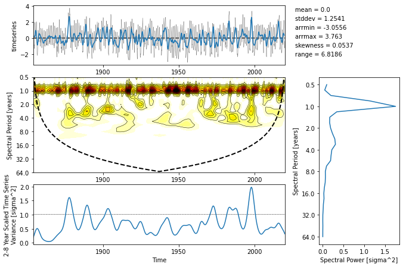

# xwavelet
### A tool for Xarray-based spectral and wavelet analysis

This package provides a Xarray interface to the [Torrence and Compo (1998)](https://paos.colorado.edu/research/wavelets/) wavelet analysis routines.

*Observed Niño 3.4 sea surface temperature variability from [NOAA OISST](https://www.ncei.noaa.gov/products/optimum-interpolation-sst)*